Rest Account API with Spring Boot and Thymeleaf 
------------

INTRODUCTION
------------
Sample Account Api

REQUIREMENTS
------------
JDK 1.8+, Maven 3.2+ , H2, Thymeleaf, Spring Data, Spring Boot

INSTALLATION and CONFIGURATION
------------
Download project import as a maven project 

Log Conf 
------------
Go to ```account-app\src\main\resources\log4j2.xml``` file 

update

``` <Property name="filename">accountApp.log</Property>``` as desired log file name

Welcome Messages
------------
update ```welcome.messages*```  under the 

```account-app\src\main\resources\application.properties``` 

H2 Conf
------------
```spring.datasource.url=jdbc:h2:file:./yourdbname;DB_CLOSE_ON_EXIT=FALSE```

```spring.datasource.url=jdbc:h2:mem:yourdbname;DB_CLOSE_ON_EXIT=FALSE```

#### Enable h2 db console 
```spring.h2.console.enabled=true```

```spring.h2.console.path=/h2```

[http://localhost:8080/h2/](http://localhost:8080/h2/)

##### Automatic Mixed Mode
Multiple processes can access the same database without having to start the server manually. 
To do that, append ;AUTO_SERVER=TRUE to the database URL. 
You can use the same database URL independent of whether the database is already open or not. 
This feature doesn't work with in-memory databases.

Example database URL:

```spring.datasource.url=jdbc:h2:file:./yourdbname;DB_CLOSE_ON_EXIT=FALSE;AUTO_SERVER=TRUE;```

##### connect to h2 db console 
select Setting Name as ```Generic H2 (Embedded)```
type JDBC URL Name as  ```jdbc:h2:./db/blue_db```
   
   <p align="center">
      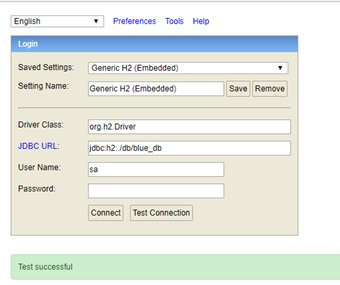
   </p>
   <p align="center">
          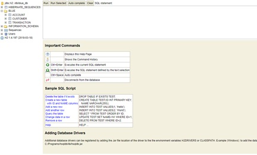
   </p>

##### Connect with Intellij IDEA  Database Navigator
    
   <p align="center">
          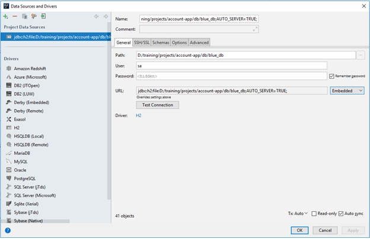
   </p>

    also dont forget selecting schema
    
   <p align="center">
            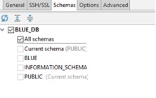
   </p>


##### CREATE  your own SCHEMA

```spring.datasource.url=jdbc:h2:file:./yourdbname;DB_CLOSE_ON_EXIT=FALSE;AUTO_SERVER=TRUE;INIT=CREATE SCHEMA IF NOT EXISTS BLUE```

database file will be created under the ```$ project.source.directory/db```

 After starting application database will be created and schema looks like :
    <p align="center">
      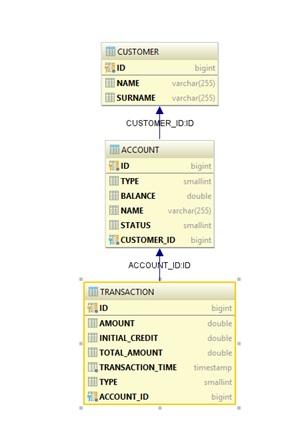
    </p>

RUN APP
------------
1. Run spring ```App```  class
2. or ```mvn clean install``` then ```cd target``` and run  ``` java -jar account-api.jar```

##### First Run with Sample Data
when running the application first time some predefined data will be inserted automatically the class which implements
 ```CommandLineRunner``` interface 
1. The First class load the customers  ```CustomerLoader``` 
2. and the second one add an account for the customers ```AccountLoader```

RUN TESTS 
------------
mvn clean test


Application GUI
------------
There is one simple Page with 2 tabs

1. Search Customer Pane

    *Customer Name: required
        
    if Customer found show all Customer details with accounts and transactions of accounts
    Otherwise prints error message
    
    <p align="center">
      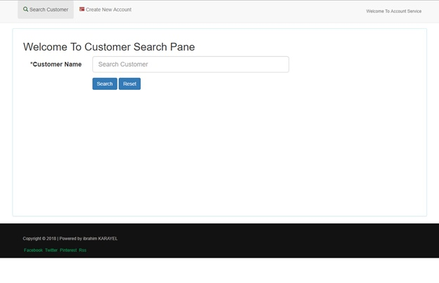
    </p>
    <p align="center">
      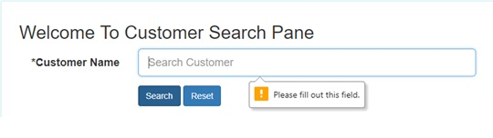
    </p>
    
    <p align="center">
       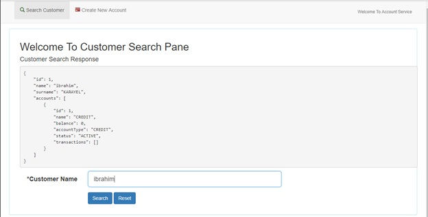
    </p>
    <p align="center">
       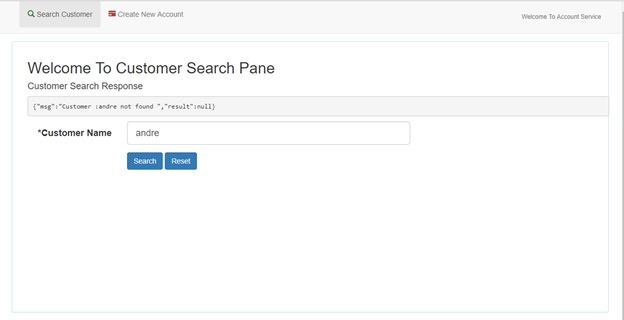
    </p>
    
2. Create New Account Pane

    <p align="center">
      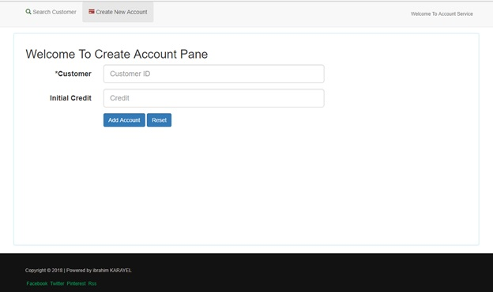
    </p>
    <p align="center">
      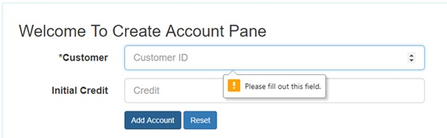
    </p>
    <p align="center">
      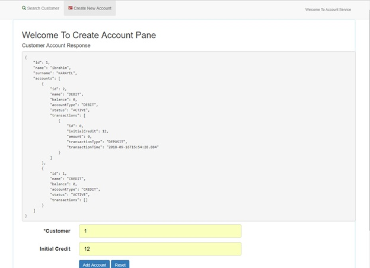
    </p>
    <p align="center">
      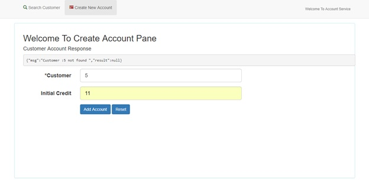
    </p>


API END POINTS
------------

##### Customer end-points

1. Get all Customers
```GET http://localhost:8080/customers```

   <p align="center">
      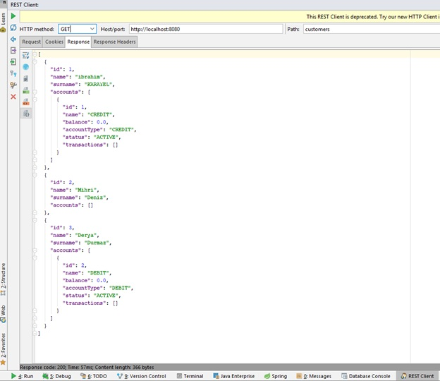
   </p>
    
2. Get Customer by customerId
```GET http://localhost:8080/customers/{id} ```
```Accept: application/json```

   <p align="center">
      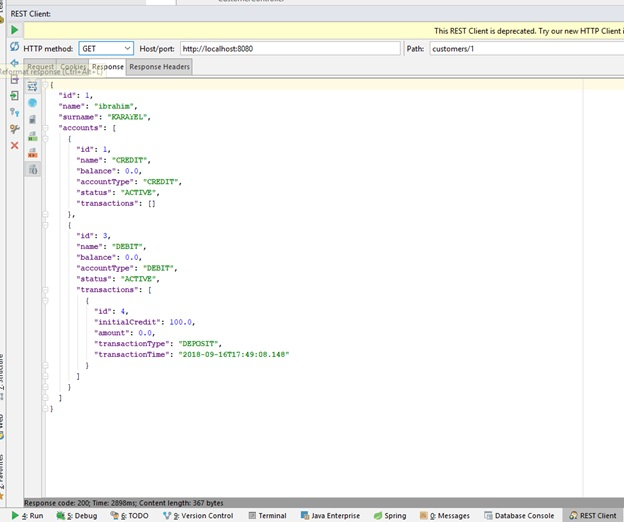
   </p>

3. Get Customer by customer Name
```POST http://localhost:8080/api/search```

   <p align="center">
      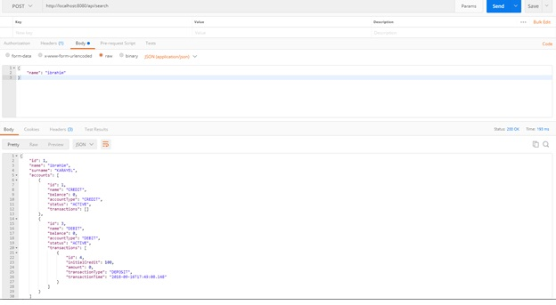
   </p>
   
   
 ##### Account end-points
 
 1. Get all accounts and details
 ```GET http://localhost:8080/accounts```
    <p align="center">
        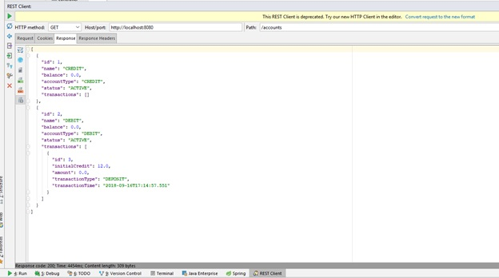
    </p>
    
 2. Get customer accounts and details by customer Id
 ```GET http://localhost:8080/accounts/{customer_id}```
 ```Accept: application/json```

    <p align="center">
        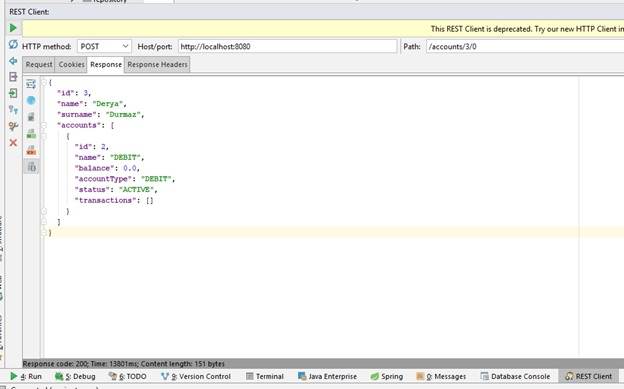
    </p>
 
 3. Open an account for given customer Id and initial credit 
 ```POST http://localhost:8080/accounts/{customer_id}/{initial_credit}```
    <p align="center">
         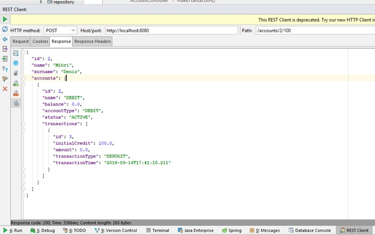
    </p>
    
 4. Open an account for given customer Id and initial credit for GUI
 ```POST http://localhost:8080/accounts/open```
 

Actuator
------------
Once the application has started, you can list all the actuator endpoints exposed over HTTP from the URL ```http://localhost:8080/actuator```
```http://localhost:8080/actuator/health ```
```http://localhost:8080/actuator/info ```


Issues
------------
1. Junit5  required surefire plugin check opened issued  
[ref] (https://stackoverflow.com/questions/36970384/surefire-is-not-picking-up-junit-5-tests)
    ```
        <plugin>
            <groupId>org.apache.maven.plugins</groupId>
            <artifactId>maven-surefire-plugin</artifactId>
            <version>2.22.0</version>
               <configuration>
                  <excludes>
                        <!-- <exclude>some test to exclude here</exclude>-->
                  </excludes>
                </configuration>
        </plugin>
    ```

2. org.springframework.beans.factory.BeanCreationException:
required dependency
    ```
       <dependency>
           <groupId>javax.xml.bind</groupId>
           <artifactId>jaxb-api</artifactId>
       </dependency>
    ```


[ibrahim karayel](https://www.linkedin.com/in/ibrahimkarayel/)
